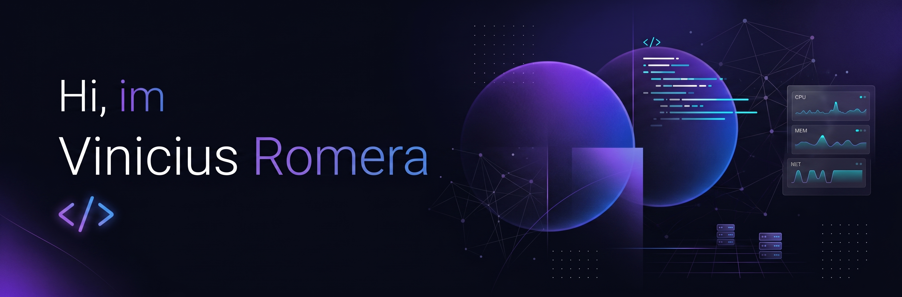

###

### 👨🏻‍💻 About me

- 💡 I'm a technology professional with 9+ years of experience in critical operations, currently transitioning into Software Development.
- 🎓 Studying Analysis and Systems Development at FATEC Sorocaba.
- 🎮 In my spare time, I enjoy automotive restomodding, playing games, watching movies and TV shows, and singing.
- 📄 Take a look at my [Resume](https://drive.google.com/file/d/10LfLlqqYoOwxNjAn_I62fWDflwQT4aPg/view?usp=drive_link) or my [LinkedIn](https://www.linkedin.com/in/viniciusromerac/) for more details about my experience. You can also find my resume in [Portuguese](https://drive.google.com/file/d/1IArzRMRvWXOCaGHDFWn6aFVOAXpv9yJe/view?usp=drive_link).
  

---

### 🛠️ Tech Stack

**Languages & Frameworks**
 

**Databases**
 

**Tools & Productivity**
 

**Design & Creativity**
 

**Artificial Intelligence**
 

---

### 💻 Highlighted Repositories

  
  
  
  

 
---

### 📫 Let's Connect!

Feel free to reach out to talk about technology, software development, or new opportunities.

  
  

###
###

<picture>
  <source media="(prefers-color-scheme: dark)" srcset="https://raw.githubusercontent.com/Romerac/Romerac/output/pacman-contribution-graph-dark.svg?v=2">
  <source media="(prefers-color-scheme: light)" srcset="https://raw.githubusercontent.com/Romerac/Romerac/output/pacman-contribution-graph.svg?v=2">
  
</picture>

###
###

